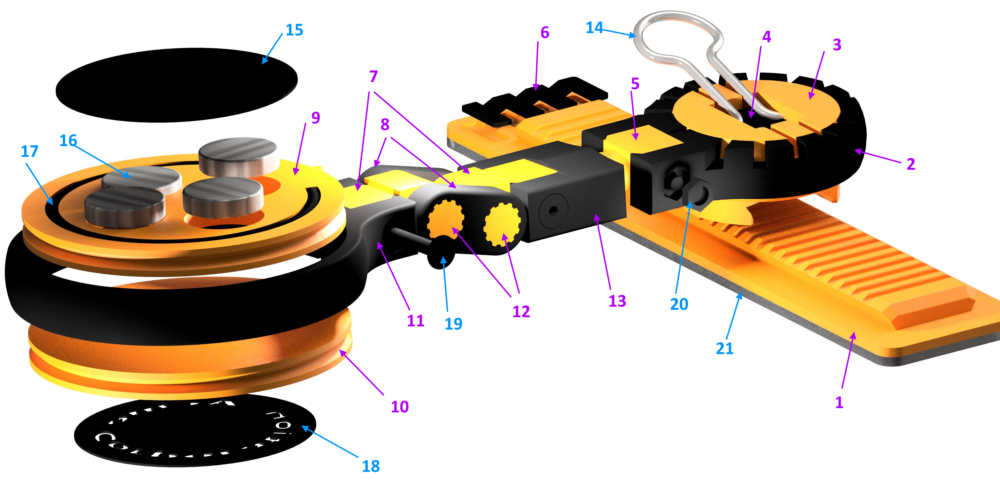

# RAIL-MOUNTED PHONE HOLDER
[rail-mounted website](https://www.rail-mounted.com)

## License

This work is licensed under the CC0 1.0 Universal license terms. Refer to the License file in this directory for details.

## Use

Use on monitors and laptops, workbenches, in cars, on walls and furniture.

## Benefits

  - No knobs to tighten as there is no need to keep adjusting the viewing angle
  - Holder rotates to expose either the main or the selfie camera
  - Strong magnets keep the phone safe even with the metal plate inside the case
  - Slider allows phone to rest on table to avoid small laptops (13") from falling backwards
  - Customizable colors and color combinations
  - Brandable face plates

## Components

### 3D-Printed Parts

| Index | STL File Name | Material |
| ----- | ------------- | -------- |
| 1     | base.stl                 | Prusament PETG |
| 2     | slider-bracket.stl       | Prusament PC Blend |
| 3     | slider.stl               | Prusament PETG |
| 4     | slider-lock.stl          | Prusament PC Blend |
| 5     | axle.stl                 | Prusament PC Blend |
| 6     | -                        | Prusament PETG |
| 7     | arm-bracket.stl          | Prusament PC Blend |
| 8     | arm-top.stl              | Prusament PC Blend |
| 9     | holder-insert-mag.stl    | Prusament PETG |
| 10    | holder-insert-no-mag.stl | Prusament PETG |
| 11    | holder-bracket.stl       | Prusament PC Blend |
| 12    | arm.stl                  | Prusament PC Blend |
| 13    | slider-connector.stl     | Prusament PC Blend |

### Hardware

| Index | Description  | Link |
| ----- | ------------ | ---- | 
| 14    | One of the wires from a small binder clip | [link](https://www.amazon.com/Mr-Binder-Clips-Small-Office/dp/B0882T9GFN) |
| 15    | Vinyl decal - magnet side; Cricut Premium Vynil True Brushed | [link](https://cricut.com/en_us/premium-vinyltm-true-brushed.html)|
| 16    | Magnets - 4 x N52 1/2 1/8, Nickel-coated | [link](https://www.kjmagnetics.com/proddetail.asp?prod=D82-N52) |
| 17    | Silicone ring cut to fit the holder insert channel; Scunci No-slip Grip Evolution Bright Jelly Ponytailers | [link](https://www.amazon.com/Scunci-28pk-Noslp-Evolution-Elastics/dp/B00H3R28C6/) |
| 18    | Branding vinyl decal - non-magnet side; Cricut Premium Vynil True Brushed with logo cutout | [link](https://cricut.com/en_us/premium-vinyltm-true-brushed.html) |
| 19    | 4-40 x 3/4 hex flat head cap screw | [link](https://www.mcmaster.com/socket-head-cap-screws/head-type~flat/thread-size~4-40/length~3-4-2/) |
| 20    | 18-8 4-40 black oxide small pattern nut | [link](https://www.mcmaster.com/nuts/thread-size~4-40/finish~black-oxide/hex-nut-profile~narrow/) |
| 21    | Natural polyurethane double coated foam tape 1" width | [link](https://www.amazon.com/Mounting-Papercrafting-Projects-Adhesive-Converted/dp/B07MDM4X4C/) | 